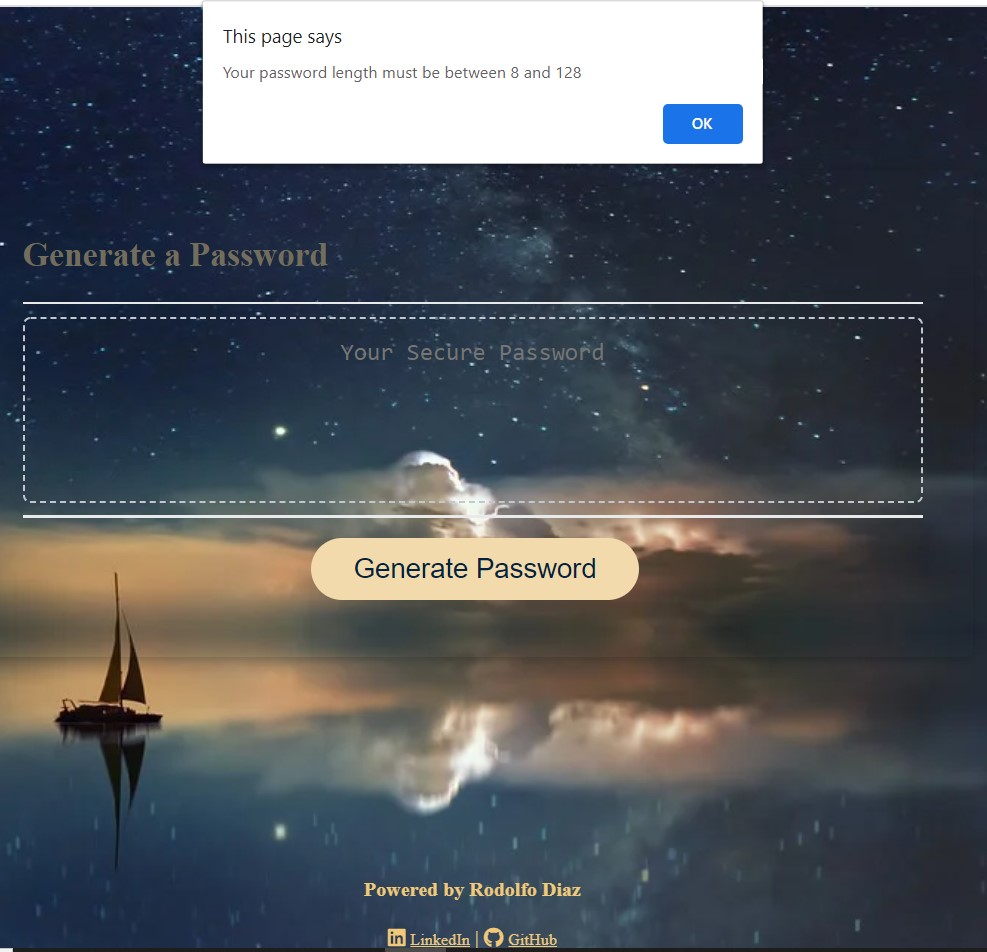
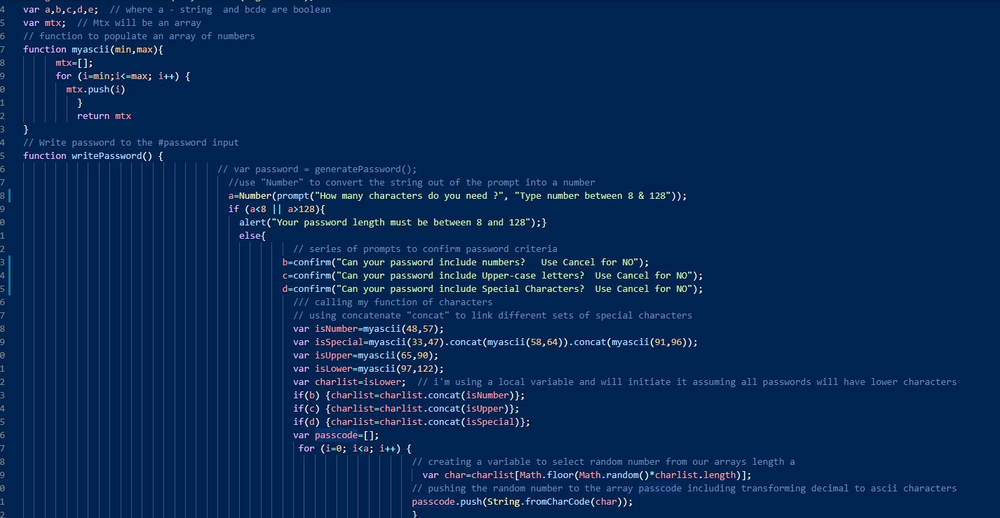

# Rodolfod1.passwordGenerator
Password Generator

#My approach to this password generator:
- This code was designed to contain loops, lists, arrays and simple functions.
- The main idea is to manipulate numbers to represent all characters on Ascii code; after all number manipulation (random between ranges, sorting, pushing to arrays) the final array is populated with ascii characters.

### Follow this link to try the deployed Application
    https://rodolfod1.github.io/Password-Generator/index.html

## **  About the application **
* Run the application:
  - the user just need to click the "Generate Password" button.
    - This is how the application will appear as it loads:
    

- the user is presented with a series of prompts to set the password criteria.
- Criteria includes but not limited to: Caps, Numbers, Special characters.
  

* Style:
- Existing html and css, were modified to adapt a sober and bold style. 
 
 * About Javascript. 
  - simple variables were used to gain efficiency on coding and debugging. 
  - balance between global and local variables to facilitate and easier analysis and debugging.
   - the following image is an example of my source code 
   

  *This Project contents:
  - Index.html - hosting the web page application .
  - Script.js - Code for executing the app. 
  - style.css - original + customized style for the application.
  - README.md - this file.  
 

  =================================================================================
  ### How to best use this 
   - please fork and clone this repository 

 contact me at:
 https://github.com/Rodolfod1
 or direct email: rodolfodzr@gmail.com

 Rodolfo Diaz, Sep,26,2020
